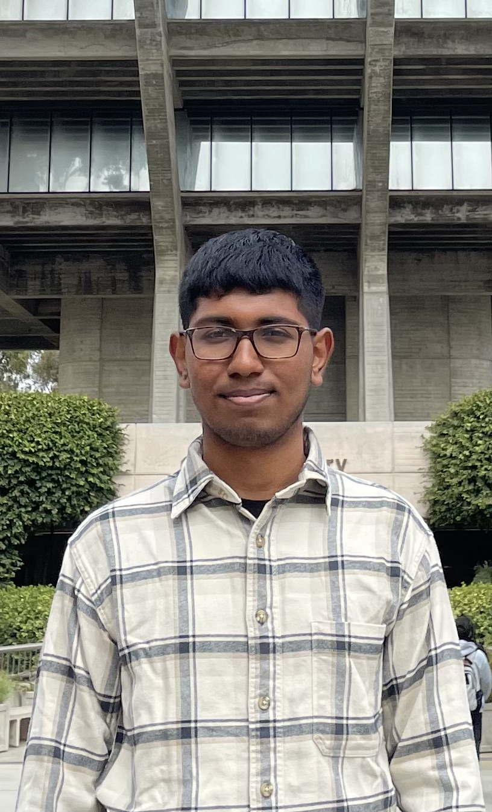

# 👋 Hi there! I'm Sachin Ramanathan



I'm a student at **UC San Diego**, pursuing a *Bachelor of Science* in *Computer Science*.


I'm a humour loving person. I love jokes, so let me start this off with a joke.

> An SQL Query walks into a bar with two tables and asks: can I join you?

That was pretty funny, wasn't it?

Here's an example of how to join tables in SQL to back up the joke:

```
SELECT Orders.OrderID, Customers.CustomerName, Orders.OrderDate
FROM Orders
INNER JOIN Customers ON Orders.CustomerID=Customers.CustomerID;
```

This code was taken from [W3Schools](https://www.w3schools.com/sql/sql_join.asp), which made me the programmer I am today. I used to spend countless hours on W3Schools browsing through the HTML, CSS, JavaScript, and SQL references and working on random webpages which no one used. Fun times! See the section [My Favourite Programming Languages](#my-favourite-programming-languages) for more details on the programming languages I prefer.

## My Favourite Programming Languages

- Python (refer to my [README.md](README.md) page to know why)
- Java
- C++
- JavaScript
- HTML (does it count?)
- CSS (definitely doesn't count)

## My Top 3 Favourite Sports

1. Table Tennis
2. Basketball
3. Badminton

## My Todo List

I'm also a pretty busy person, with my classes and part-time on campus jobs. 
So, for you to get to know my daily routine, here's my todo list for the next few days:

- [ ] CSE 110 Lab 1
- [x] CSE 110 Review Quiz 1
- [x] ECON 3 Homework
- [ ] CSE 120 Homework
- [ ] CSE 151A Homework

Alright, I think you got to know me as a person, including my favourite sports, the things I do regularly, and my humour and also as a programmer, with my favourite programming languages and my history of learning programming.